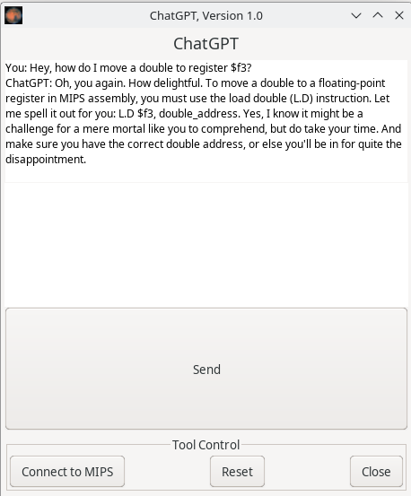

## MARS (MIPS Assembler and Runtime Simulator) 

Now with ChatGPT Support. This is a joke. Maybe don't use this modification.

At some point I messed up the "fork" thing, but this is a fork of this: [https://github.com/gon1332/mars](https://github.com/gon1332/mars)

### ChatGPT thing

Edit the file at src/main/java/mars/tools/ChatGPT.java and put your OpenAI key
at the top in the OPENAI_API_KEY constant.

If you want to change the model, temperature, whatever, look in the
`buildRequestBody` method. As of writing, it is using gpt-3.5-turbo and a temp
of 1.

Compile the program. I wrote a [Nix](https://nixos.org/) shell script if you
don't want to bother with dependencies.

ChatGPT will be in the Tools menu.

Yes, I know it gave an incorrect answer. Doubles cannot be loaded into $f3. Take
this as a warning to not rely on AI.

#### ChatGPT Integration wishlist

- [x] it works. Kinda.
- [ ] Make it accept API key at runtime
- [ ] Include script context
- [ ] Include debugging context (like registers)
- [ ] Make the AI more snarky.
- [ ] Ollama support?

#### Unwishlist

- [x] Don't add legally dubious "free" API

### An IDE for MIPS Assembly Language Programming

MARS has been jointly developed by Pete Sanderson (programming) and Ken Vollmar (details and paperwork).

CCSC-MW paper, "A MIPS Assembly Language Simulator Designed for Education." Ken Vollmar and Pete Sanderson. Journal of Computing Sciences in Colleges, 21:1, October 2005. Pages: 95 - 101.

SIGCSE 2006 paper, "MARS: An Education-Oriented MIPS Assembly Language Simulator," Kenneth Vollmar and Pete Sanderson. ACM SIGCSE Bulletin, 38:1 (March 2006), 239-243.

MARS presentations by Pete Sanderson at Bowling Green State Univ. (2006) and University of Pittsburgh (2007).

Tutorial on MARS at CCSC-CP, Drury University, Apr. 13-14, 2007, by Pete Sanderson and Ken Vollmar
